-------------------------------------------------------------------------------------------------------
### Please note: I am the first language is ISL (Irish Sign Language). I write in the second English language. I hope you read and understand the ReadMe.
-------------------------------------------------------------------------------------------------------

## Concept Project

* The concept project for the movies quiz. The design function is very basically in javascript.

- The projects follow below:

## Brainstorm 
* Design mindmap for the functions:

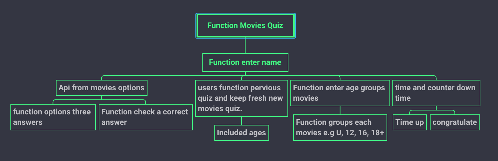

 # Quick Sketch UX
 * ## Desktop & Mobile

# Wireframe 
* # Design wireframe UX for Desktop & Mobile

* ## Desktop
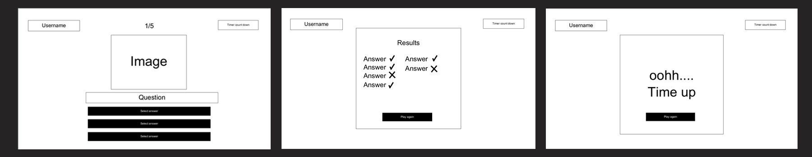

* ## Mobile
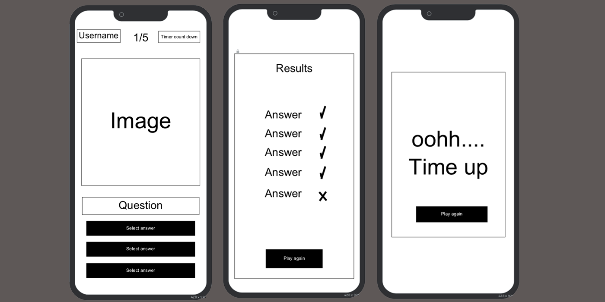

## Colour Pallet

* I choose the colour pallet, I catch my eye with the colour that I like where I serached website that I found one I choose the [colour pallet](https://www.letseatcake.com/color-palettes-from-films/) and I took a screenshot as see attached here:

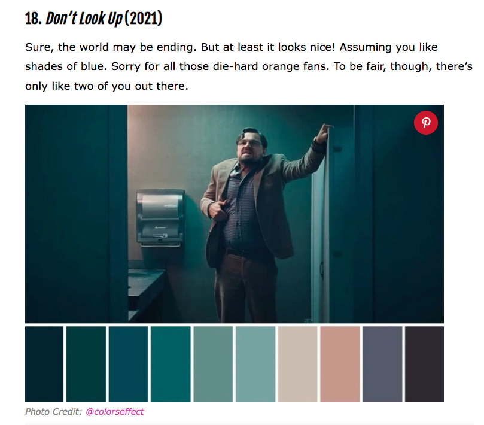

* ## I choose some of the color, see picture below:
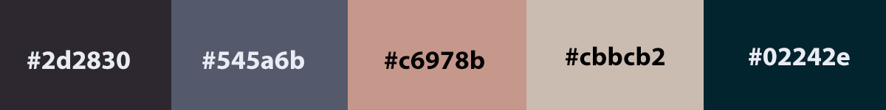

-------------------------------------------------------------------------------------------------------
# Design and development the movie quiz for desktop & mobile devices

## Logo: Movies Quiz

Features
-------------
* The site is a Movie Quiz The target is users who are interested in movies and challenge their knowledge of the movies by following directors, actors, writing screenplays, editors, and so on.

Existing Features
-----------------------
### Navigation Bar

* The header menu are three pages which are Home, Movie Quiz and Contact.

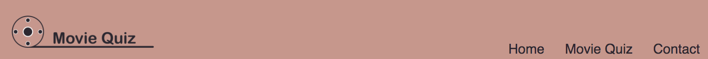

### Home page
* Display on the front image layout page
* The image below the button to enter play game or there is either on top of the menu 'movie quiz'.

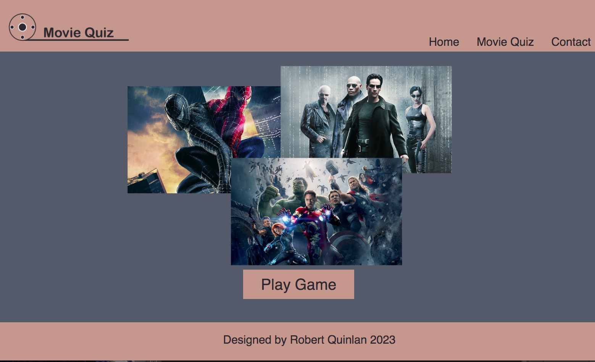

### Entry Username for the Movie Quiz page

* Either click to Play Game button or Movie Quiz on the menu page,
* Then first fill in the username, if you don't fill in the name and it won't enter the game until you fill in the username then it will be able to enter the quiz. See the picture below:

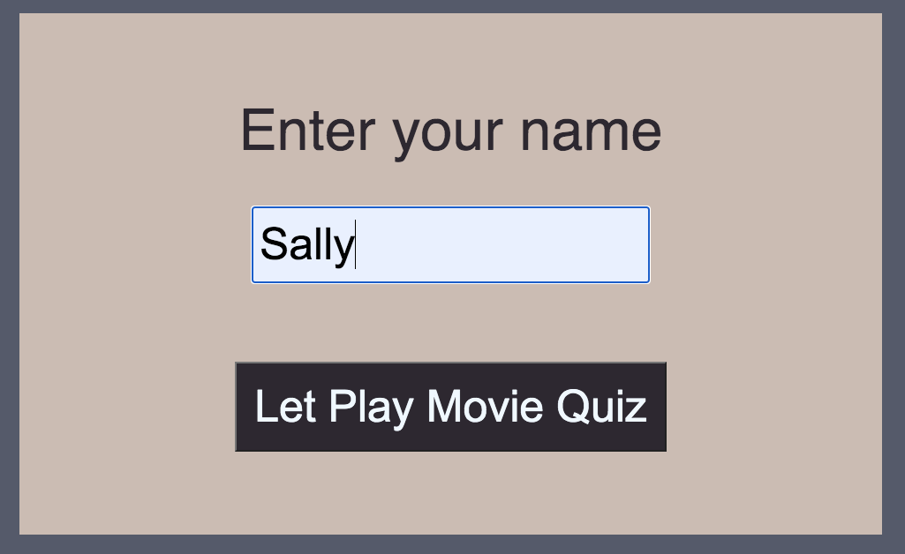

* when you enter username and click button _**`Let Play Movie Quiz`**_   then go to the Movie Quiz page as you can see the underline red highlight of the username. 
* On the top display "Welcome _**`username`**_   to Movie Quiz, it will display your name when you fill in the username. See the picture below: 

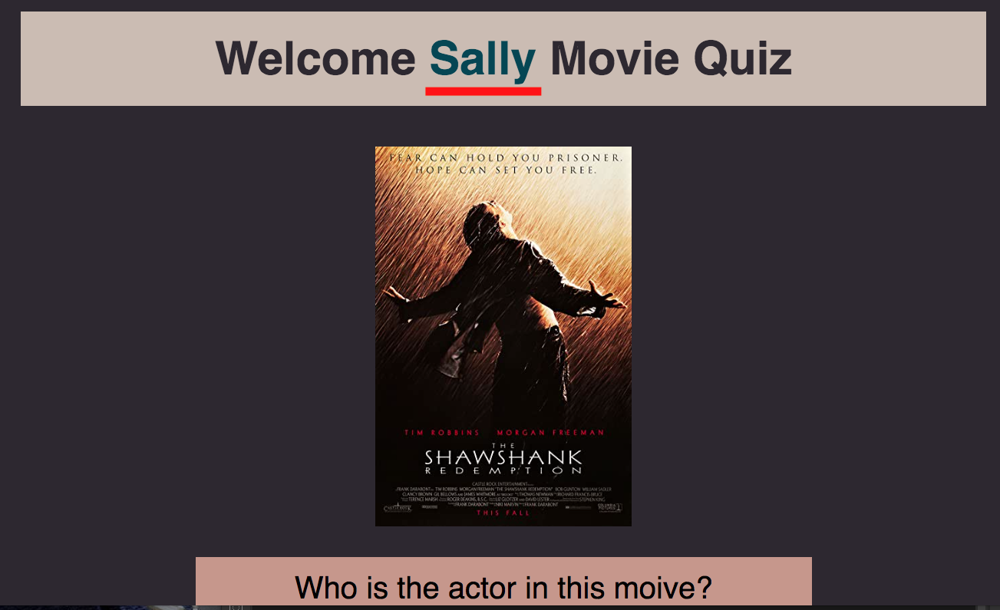

### Select the answer to the question on the movie quiz page

* To roll up the demand for the screen
* There is a button _**`Next`**_   to the next up to 4 questions
* There is a roll hover highlight background colour
* When you click on the answer and it will display a red or green highlight which is either right or wrong the answers and at the top end of the quiz, it is pop an up screen to ask if would you like to play again, there is either yes or no, if yes back to movie quiz and go back to home page. See three pictures

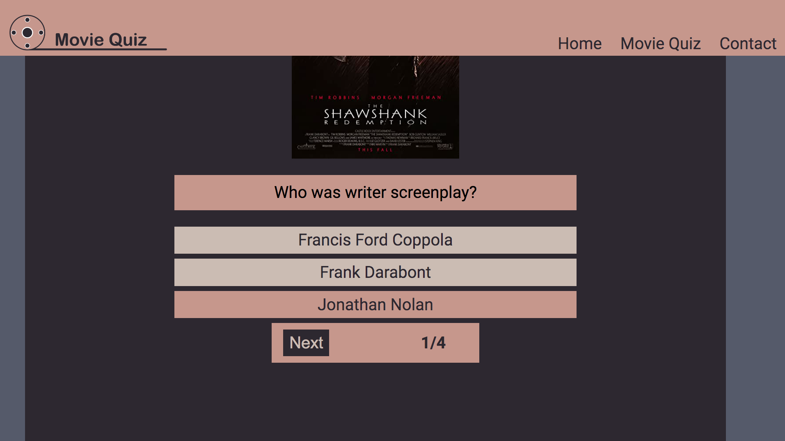 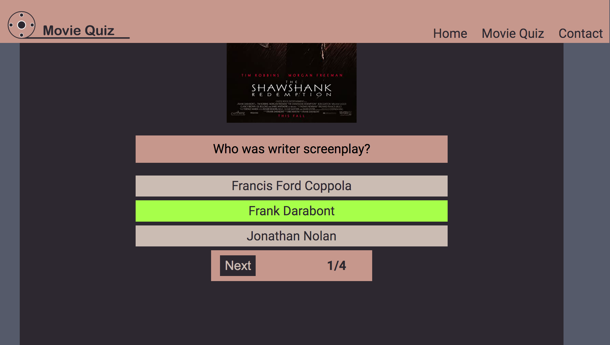 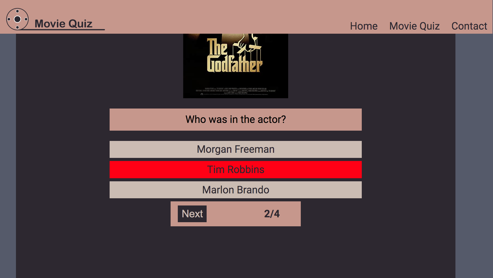 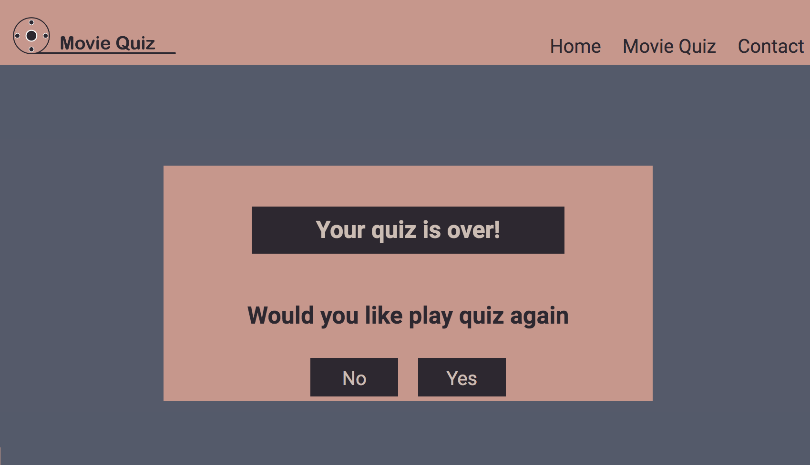

### Contact page

* Send a request to the users who wish to have any comments.  See the picture, which it is responsive screen as see below:

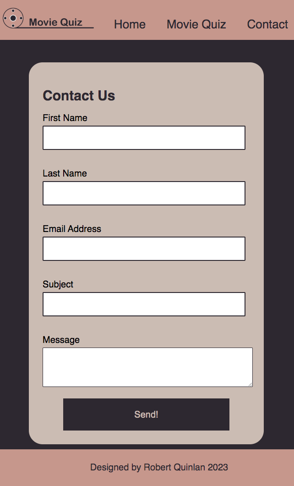

### Footer 
* keep simple display as who is design of the website by me.

### Testing
* The testing runs testing for Chrome, Opera, Microsoft Edge and Firefox and it does support them. All the screens are fine and responsive but sight little different sizes of aspect screens. 

### The lighthouse runs testing and results.
* there was a quite low performance at the lighthouse. I made add Alt in each image, and also I add to Meta keywords. It went to improve the results as the seen picture below:
* ## Home page
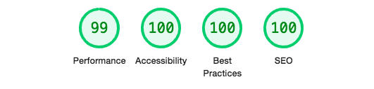

* ## Movive Quiz page
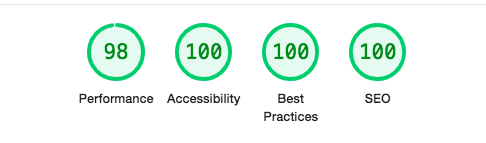

* ## Contact page

## Validation testing

### HTML
* Had been found few errors when the test run through the official W3C validator.
- there was an error which tag  `<h3>` it does not use it, replaced to ` 
`  I had to do the fixed bug and it was all pass and no errors.

### CSS
- The official (Jigsaw) validator. It was all passed and no errors.

### JavaScript
* The test ran at [Javascript testing](https://jshint.com/)  and there were 24 warnings. I fixed the bugs and reduced the warning; it was all no errors.

# Deployment

The GitHub page where is deployed. How do processing the site deployed as follows:

* Use files on the GitHub page and choose one of the files where it is in the “portfolio-project-1-robert-quinlan” file
* Click on setting 
* On the left side follow the list of options
* To click on ‘page’
* The source under the option to “Deploy from a Branch”
* The Branch under to open to main and root then click to save. 
* It ran the deployment processing while it is successful.

The site lives at [Movie Quiz](https://rqisl.github.io/portfolio-project-2-robert-quinlan/)

## Credits

I was nervous to do projects because I had experienced how difficult through javascript where I studied for Multimedia BA degree. I started project 2, I found it was extremely difficult all over again. My concept was before start developing the site and turn out I was not able to full completed which are get result, age group and time up game. I had spend to learning other resource a lot of time. I tried to understand the javascript but I was disppointed because I could not understand what they have explaining. Cause it was not my first English language. 

My mentor had good feedback and helps with my process improvement on site project. 

## Resouce & tutorial
* ### I learned as many resources as possible I could learn.

1) [Ridpidapi video for API to get images of the poster](https://www.youtube.com/watch?v=ytNyibPQFhw) 
1) [Pick one of the images how to use](https://makersaid.com/array-of-images-in-javascript/)
1) [Hidden Click](https://www.w3schools.com/css/tryit.asp?filename=trycss_display) 
1) How can I structure the quiz concept?
    - [Example quiz 1](https://simplestepscode.com/javascript-quiz-tutorial/)
    - [Example quiz 2](https://www.youtube.com/watch?v=f4fB9Xg2JEY) 
1) [Output result](https://codepen.io/yaphi1/pen/NpZvJp)
1) [How can  I do the question to the next slide](https://www.youtube.com/watch?v=uAAD3mmQGRQ)
1) [Array through to Code Institute resource](https://learn.codeinstitute.net/courses/course-v1:CodeInstitute+LMR101+2021_T1/courseware/0a4bf408d10c4149bb686457ac11edf6/9ad9ed6044aa49c0ae12507f3c03aa79/)
1) [Entry username on the screen through Code Institute](https://learn.codeinstitute.net/courses/course-v1:CodeInstitute+LMR101+2021_T1/courseware/0a4bf408d10c4149bb686457ac11edf6/16d62f1111064f5cb6a64582da96a41b/?child=last.)
    - [Example 1](https://youtu.be/Iw6fyph6MNw)
    - [Example 2](https://youtu.be/KB6Yg5hNrqc)
    - [Example 3](https://www.youtube.com/watch?v=aEj0Wu33hJM) 
1) Click highlight
    - [Example 1](https://learn.codeinstitute.net/courses/course-v1:CodeInstitute+LMR101+2021_T1/courseware/0a4bf408d10c4149bb686457ac11edf6/fe180c06af614d2f86e32957ae17a859/?child=last) 
    - [Example 2](https://learn.codeinstitute.net/courses/course-v1:CodeInstitute+LMR101+2021_T1/courseware/0a4bf408d10c4149bb686457ac11edf6/fe180c06af614d2f86e32957ae17a859/?child=last)
    - [Example 3](https://stackoverflow.com/questions/39852228/style-backgroundcolor-doesnt-work)
1) Click highlight remove and active 
    - [Example 1](https://learn.codeinstitute.net/courses/course-v1:CodeInstitute+LMR101+2021_T1/courseware/0a4bf408d10c4149bb686457ac11edf6/37e3becd93804fdf8bf586523f56ead5/5?activate_block_id=block-v1%3ACodeInstitute%2BLMR101%2B2021_T1%2Btype%40html%2Bblock%404b2504c0ab4e40d6b42d4b527776707a)
    - [Example 2](https://softauthor.com/make-selected-clicked-button-active-in-javascript/)
1) [Output HTML in javascript](https://learn.codeinstitute.net/courses/course-v1:CodeInstitute+LMR101+2021_T1/courseware/0a4bf408d10c4149bb686457ac11edf6/37e3becd93804fdf8bf586523f56ead5/) 
1) [Overlay 3 W School](https://www.w3schools.com/howto/howto_css_overlay.asp)
1) For loop
    - [Example 1](https://www.w3schools.com/jsref/tryit.asp?filename=tryjsref_onclick)
    - [Example 2](https://www.w3schools.com/jsref/tryit.asp?filename=tryjsref_foreach)
    - [Example 3](https://www.freecodecamp.org/news/javascript-foreach-js-array-for-each-example/amp/)
    - [Example 3](https://www.freecodecamp.org/news/javascript-foreach-js-array-for-each-example/amp/)

## Adobe Photoshop & Illustrate

* The logo images where I created the Photoshop. I downloaded the image comes from [www.vecteezy.com](https://www.vecteezy.com/vector-art/19115573-creative-business-card-and-logo-template-album-film-movie-reel-vector-illustration). It is free licence. I choose a roll movie image and edited to create a logo where I used Adobe Illustrate. 
* The layout movie poster on the front page which comes from [www.wallpaperflare.com/](www.wallpaperflare.com/), It is free to allow download who wish to use wallpaper on the usernames' desktop, laptop, tablet or mobile.
* I downloaded three movie posters:
    - [Matrix](https://www.wallpaperflare.com/the-matrix-poster-movies-neo-keanu-reeves-morpheus-carrie-anne-moss-wallpaper-mjcss/download/1920x1200)
    - [Avengers](https://www.wallpaperflare.com/marvel-avengers-the-avengers-avengers-age-of-ultron-thor-wallpaper-zkw/download/1920x1200)
    - [Spiderman](https://www.wallpaperflare.com/spider-man-movies-spider-man-3-marvel-comics-black-suited-spiderman-wallpaper-pnkas/download/1920x1200)
* I made an overlapping layout of the movie posters where I used Adobe PhotoShop 

## Concluded 

* I completed my concept project for the Movie Quiz. I created very basic on javascript. The site lives [Movie Quiz](https://rqisl.github.io/portfolio-project-2-robert-quinlan/).