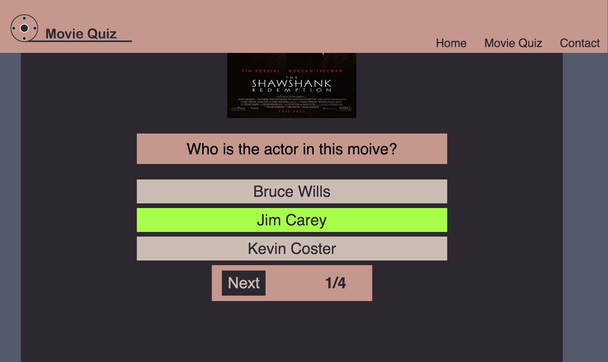

## Concept Project

* The concept project for the movies quiz. The design function is very basically in javascript.

- The projects follow below:

## Brainstorm 
* Design mindmap for the functions:


 # Quick Sketch UX
 * ## Desktop & Mobile


# Wireframe 
* # Design wireframe UX for Desktop & Mobile

* ## Desktop


* ## Mobile


## Colour Pallet

* I choose the colour pallet, I catch my eye with the colour that I like where I serached website that I found one I choose the [colour pallet](https://www.letseatcake.com/color-palettes-from-films/) and I took a screenshot as see attached here:


* ## I choose some of the color, see picture below:


--------------------------------------------------------------------------------------------------------
# Design and development the movie quiz for desktop & mobile devices

## Logo: Movies Quiz


Features
-------------
* The site is a Movie Quiz The target is users who are interested in movies and challenge their knowledge of the movies by following directors, actors, writing screenplays, editors, and so on.


Existing Features
-----------------------
### Navigation Bar

* The header menu are three pages which are Home, Movie Quiz and Contact.


### Home page
* Display on the front image layout page
* The image below the button to enter play game or there is either on top of the menu 'movie quiz".


### Entry Username for the Movie Quiz page
* Either click to Play Game button or Movie Quiz on the menu page,
*Then first fill in the username, if you don't fill in the name and it won't enter the game until you fill in the username then it will be able to enter the quiz. See the picture below:


* when you enter username and click button _**`Let Play Movie Quiz`**_   then go to the Movie Quiz page as you can see the underline red highlight of the username. 
* On the top display "Welcome _**`username`**_   to Movie Quiz, it will display your name when you fill in the username. See the picture below: 


### Select the answer to the question on the movie quiz page

* To roll up the demand of the screen screen
* There is a button _**`Next`**_   to the next quest up to 4 question
* When you clcik onto the answer and it will be display red or green highligh which it is either right or wrong the answers. See a couple of pictures to show either right or wrong answers

 

### Contact page

* Send a request to the users who wish to have any comments.  See the picture, which it is responsive screen as see below:


### Footer 
* keep simple display as who is design of the website by me.


### Testing
* The testing runs testing for Chrome, Opera, Microsoft Edge and Firefox and it does support them. All the screens are fine and responsive but sight little different sizes of aspect screens. 


### The lighthouse runs testing and results.
* there was a quite low performance at the lighthouse. I made add Alt in each image, and also I add to Meta keywords. It went to improve the results as the seen picture below:


### Validation testing

#### HTML
* Had been found few errors when the test run through the official W3C validator.
- Incorrect open and closed by div and nav, and incorrect tag rule, I had to do the fixed bug and it was all pass and no errors.

#### CSS
- Had been found four errors through the official (Jigsaw) validator.
- Missing px and incorrect %, I had to do the fixed bug and it was all pass and no errors.

### Deployment

The GitHub page where is deployed. How do processing the site deployed as follows:

* Use files on the GitHub page and choose one of the files where it is in the “portfolio-project-1-robert-quinlan” file
* Click on setting 
* On the left side follow the list of options
* To click on ‘page’
* The source under the option to “Deploy from a Branch”
* The Branch under to open to main and root then click to save. 
* It ran the deployment processing while it is successful.

The site lives at [Michael Collins Legend](https://rqisl.github.io/portfolio-project-1-robert-quinlan/)

## Credits

I learned through the course in Code Institute. I do most learning of different open source on 3WC it helps to remember what the code used tags and style CSS for HTML and CSS, also what I am interested in as scroll smooth, icons, and transitions. I did a few learning to CodePen. 

My mentor had good feedback and helps to my process improvement on site project. 

## Here is my projects: 
________________

### Contents

* I was interested in the active current on the section page. I took the jQuery, it comes from [CodePen.](https://codepen.io/arjunamgain/pen/RwWoQM)  

### Favicon 
* I use previous website which is now not on the server anymore. I copied the folder here and replace the icon image through photoshop. 

See the imagthe e iconthe  on the head of the site


### Social media icons

* I took the social media icon from the [3CWhool.](https://www.freepiimageree-vector/social-media-logo-collection_3966112.htm#query=social%20media%20icon&position=7&from_view=keyword) 

### Specifies size screen for responsive
* I searched and icon the link [Screen size responsive,](https://screensiz.es/monitor) it helps me to know the exact screen size from Desktop, laptop, tablet and mobile devices for the queries media responsiveness.

* I use MacBook pro laptop with a 17” screen and it is very hard to know approx for a large desktop screen. I had experienced difficulty knowing the exact screen size. 

### What I did using queries media list in the CSS.

``` markdown
/*Desktop responsive*/
@media only screen and (max-width: 2070px) {…………}
```

``` markdown
 /* large tablet and small laptop responsive*/
 @media only screen and (max-width: 1354px)  {…………}
```

``` markdown
/*tablet responsive from 650px up to 950px) */
 @media only screen and (max-width: 950px)  {…………}
```

``` markdown
/* large mobile, from 450px up to 750px */
@media only screen and (max-width: 750px) {…………}
```

``` markdown
/* mobile standard responsiveness  for max 450px screen*/
@media only screen and (max-width: 450px)  {…………}
```

``` markdown
 /* small mobile responsiveness  for max 350px screen*/
 @media only screen and (max-width: 350px) {…………}
```

``` markdown
/* smaller mobile  responsiveness */
@media only screen and (max-width: 320px)  {…………}
```

### The dash button icon

* I took an icon dash button from [3WC School.](https://www.w3schools.com/howto/howto_css_icon_buttons.asp)

### Timeline 

* I did create my own CSS for the timeline history. I had experienced difficulty with a responsive timeline. I decide to copy from [3WC School for the timeline](https://www.w3schools.com/howto/tryit.asp?filename=tryhow_css_timeline) and I had a few modifications to make the position fit the screen and also responsiveness. The reason is to prevent my time delay. 


### Media

* All the images come from Michael Collins’s Wikimedia and are free to share and link the images and embed a file from Wikimedia. It is in the public domain.

* I like the two images on my site of the project. The mentor pointed out the rights of the images  who are holders' rights. I was concerned about the images, I asked one of the Cohort Facilitators. He instructed me to use a reference and give an example:

``` markdown
Creator, Year. Title [Online]. Place of publication: Publisher (if known). Available from: URL [Accessed date].

e.g. NASA, 2015. NASA astronaut Tim Kopra on Dec. 21 spacewalk [Online]. Washington: NASA. Available from: https://www.nasa.gov/image-feature/nasa-astronaut-tim-kopra-on-dec-21-spacewalk [Accessed 7 January 2015].
```

### Detailed references:

The references holders' images details are: 

* Leo Whelan (10 January 1892 – 6 November 1956
), Fine Art Painting,  Available from: https://www.historyireland.com/michael-collins-military-dictator/  [Accessed 12 December 2023].

* Janice O Connell f22 Photography,  Available from: <https://www.google.com/search?q=michael+collins+house+cork&tbm=isch#imgrc=OcxaVe7zvb0x1M>  to Facebook page [Accessed 12 December 2023].


### Adobe Photoshop

* The logo of Michael’s head silhouette images where I created the Photoshop. Also, Michael’s head on the Doric image which is downloaded comes from [www.vecteezy.com](https://www.vecteezy.com/vector-art/11014285-museums-museum-columns-museum-lines-museum-pillar-logos-museums-with-minimalist-and-modern-concepts-logos-can-be-used-for-companies-museums-and-businesses) to editing together Michael’s head silhouette and Doric.

### Photoshop images

### Logo 


### Michael's head sillhoette and Droic together image


### Concluded 

* I completed my concept project for the Michael Collins Legend’s website and included responsiveness. I hope you enjoy my project on the Michael Collins Legend site. The site lives [Michael Collins Legend](https://rqisl.github.io/portfolio-project-1-robert-quinlan/).